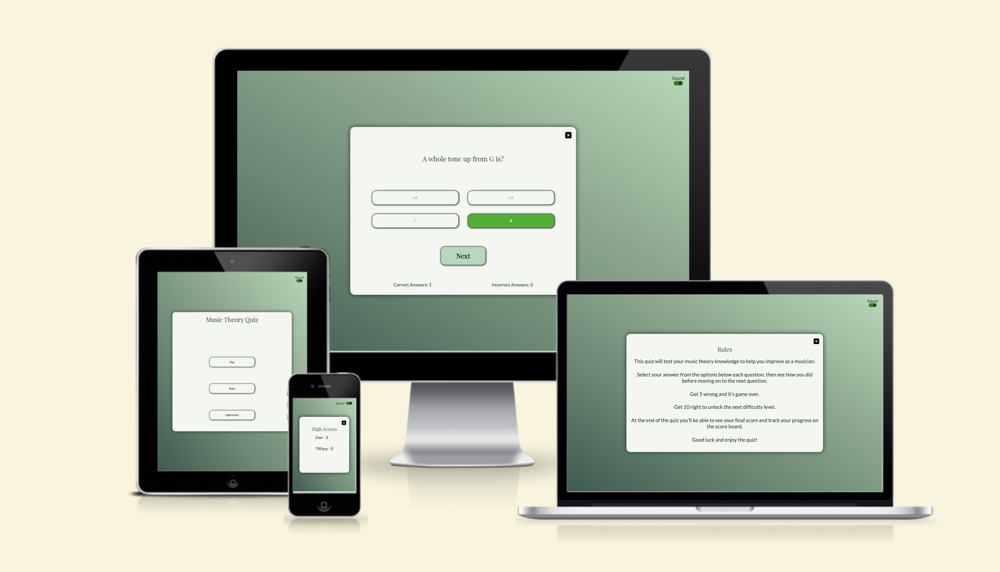
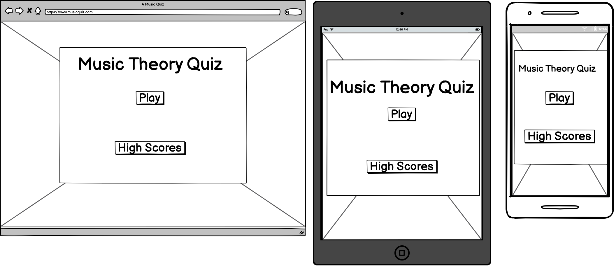
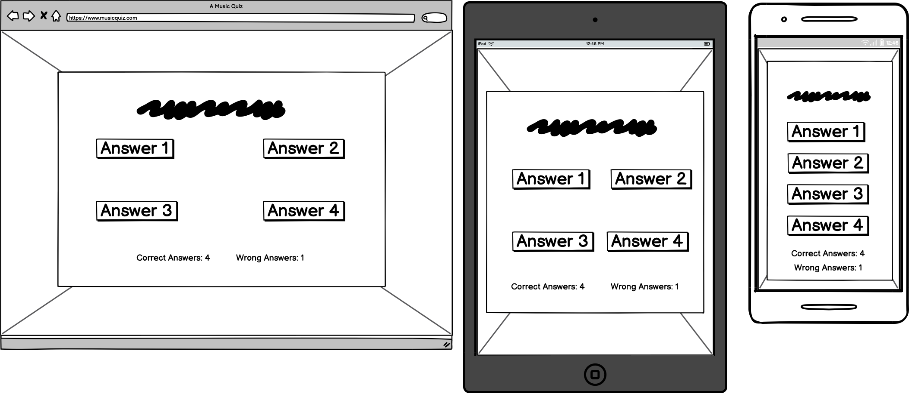
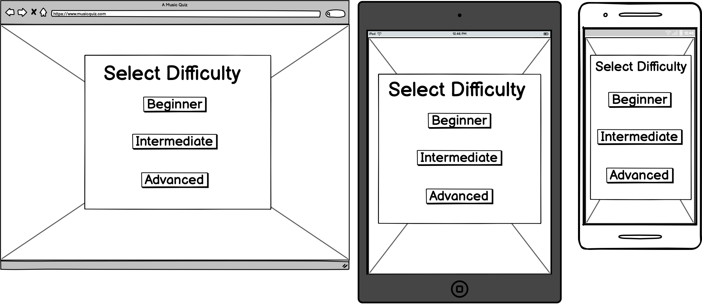
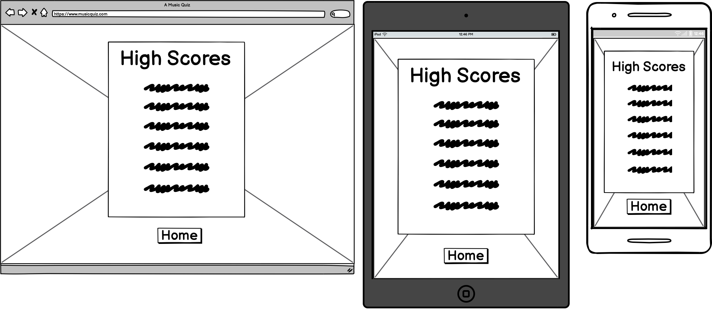
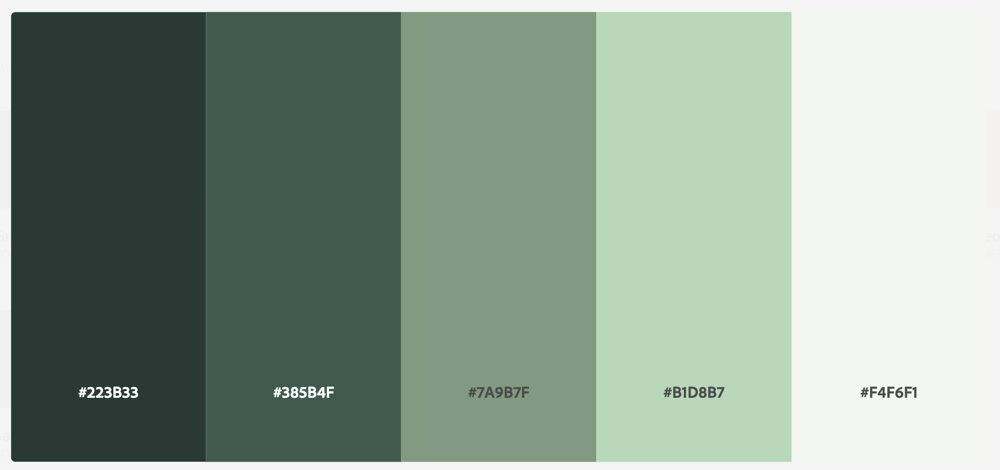
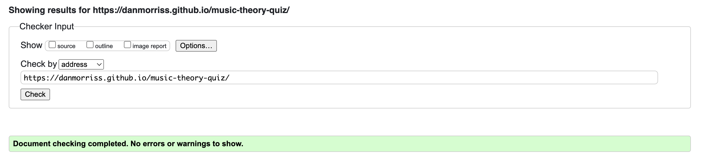
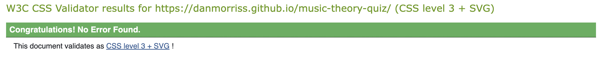
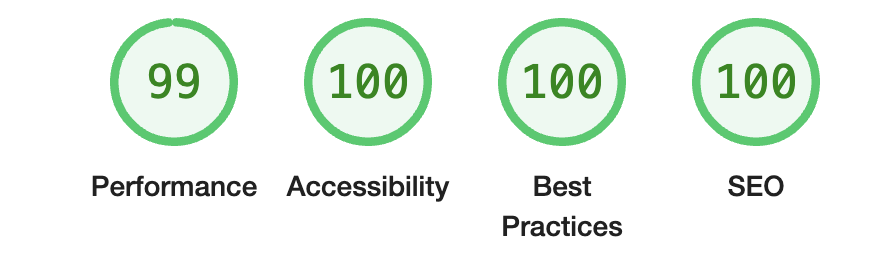
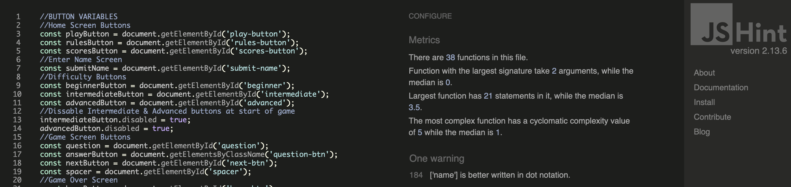

# Music Theory Quiz

### [Live Site](https://danmorriss.github.io/music-theory-quiz)

### [Project Repository](https://github.com/DanMorriss/music-theory-quiz)

## Contents

* [**User Experience (UX)**](<#user-experience-ux>)
    * [User Stories](<#user-stories>)
        * [First Time Visitor Goals](<#first-time-visitor-goals>)
        * [Returning Visitor Goals](<#returning-visitor-goals>)
        * [Frequent Visitor Goals](<#frequent-visitor-goals>)
    * [Wireframes](<#wireframes>)
        * [Home](<#home>)
        * [Game Screen](<#game-screen>)
        * [Difficulty](<#difficulty>)
        * [High Scores](<#high-scores>)
* [**Design**](<#design>)
    * [Color Scheme](<#color-scheme>)
    * [Typography](<#typography>)
* [**Features**](#features)
    * [Existing Features](<#existing-features>)
        * [Feature 1](<#feature-1>)
    * [Accesibility](<#accesibility>)
    * [Future Features](<#future-features>)
* [**Technologies Used**](<#technologies-used>)
    * [Languages](<#languages>)
* [**Testing**](<#testing>)
    * [Code Validation](<>)
        * [W3C HTML Checker](<#w3c-html-checker>)
        * [W3C CSS Checker](<#w3c-css-checker>)
        * [Lighthouse](<#lighthouse>)
    * [Responsiveness Test](<#responsiveness-test>)
    * [Browser Compatibility](<#browser-compatibility>)
    * [Peer Testing](<#peer-testing>)
* [**Bugs**](<#bugs>)
    * [Solved Bugs](<#solved-bugs>)
    * [Unsolved Bugs](<#unsolved-bugs>)
* [**Deployment**](<#deployment>)
* [**Credits**](<#credits>)
    * [Resources](<#resources>)
    * [Content](<#content>)
    * [Media](<#media>)
* [**Acknowledgements**](<#acknowledgements>)

## User Experience (UX)

### User Stories

#### First Time Visitor Goals

A fist time visitor will want to:
- test their music theory knowledge.
- be able to easily navigate the game.
- understand how to play the game.
- turn the sound on and off.
have the game beresponsive across different devices.
- be enticed back to play again.

[Back to top](<#contents>)
#### Returning Visitor Goals

A returning visitor will want to:
- porgress throught the difficulty levels.

[Back to top](<#contents>)
#### Frequent Visitor Goals

A frequent visitor will want to:
- compare their scores from previous attempts.
- try to beat their high score.

[Back to top](<#contents>)
### Wireframes

#### Home

#### Game Screen

#### Difficulty

#### High Scores

[Back to top](<#contents>)
## Design

### Color Scheme

[Adobe Color Theme](<https://color.adobe.com/Green-Blaze-color-theme-f43afa51-84f4-4c52-9114-15d25488e2dd/>)

[Back to top](<#contents>)
### Typography

[Google Fonts](https://fonts.google.com) was used for the following fonts:
- Playfair Display for the headings and questions.
- Lato for the buttons and explenation text.

[Back to top](<#contents>)
## Features
### Existing Features

#### The Rules

[Back to top](<#contents>)
#### Enter a Username

[Back to top](<#contents>)
#### Choose a Difficlty

[Back to top](<#contents>)
#### Answer the Questions

[Back to top](<#contents>)
#### High Scores

[Back to top](<#contents>)

#### Sound

[Back to top](<#contents>)
### Accesibility

[Back to top](<#contents>)
### Future Features

- Add congratulations, you answered all the questions.
- Add a database to score all users highscores outside of local storage.

[Back to top](<#contents>)
## Technologies Used
### Languages
- HTML - for the page content.
- CSS - for the styling.
- JavaSript - for the functionality of the game and storing the game questions.

[Back to top](<#contents>)
## Testing

### Code Validation
Testing using the Google Chrome Dev Tools was used throughout the build of the game. Below you can see the results of the W3C HTML, CSS & JavaScript checkers for the finished site.

#### W3C HTML Checker

#### W3C CSS Checker

#### Lighthouse

#### JSHint JavaScript Validatior

[JSHint JavaScript validator](<https://jshint.com/>)

[Back to top](<#contents>)
### Responsiveness Test

All the different pages have been tested across the following devices and screen sizes.

-
-
-

[Back to top](<#contents>)
### Browser Compatibility

The following browsers have been used to test the game.

-
-
-

[Back to top](<#contents>)
### Peer Testing

Thanks to the following people for testing the game.

- Kent Yates
- Selina Sheerin
- 

[Back to top](<#contents>)
## Bugs

### Solved Bugs

- All the different containers were displaying when I tidied up some of the CSS rules so I moved the .hide rul to the end to fix it.
- False was typed flase in the question list so wasn't functing properly.
- Checking if the selected answer matech the answer from the array wasn't working. I needed to convert both answers to text so they could be matched.
- The submit button was still displaying after an answer has been submitted. After rewriting the else statement inside the checkAnswer fuction a type was fixed and the bug was fixed.
- When the incorrect answer was selected the correct answer was not displaying. To fix this I looped through the possible answers and matched them to the correct answer. If they matched I added the correct class to it.
- I needed to dissable clicking on an answer once one has been submitted. I used .button:active:hover:not([disabled]) to allow me to add disabled to the buttons after an answer has been selected.
- There was a typo in the displayBeginnerQuestion function meaning it wasn't being called properly.
- The same question was showing on each new question. This was because I forgot to re-run the displayBeginnerQuestion function.
- The answer boxes are sometimes displaying with 1 answer per line. Added a min-width property to the css so they will always fit 2 per line unless on a small screen.
- Once you finished the game and played again you could play forever. I needed to reset the score index to 0 and clear the current score.
- The container shape changes when the next button is bisplayed. To fix this, I added a div that I sized to match the button that shows when the next button is hidden and hides when the next button shows. I also made the question height a set size to stop the buttons being pushed down then the question was on two lines.
- A question was ocasionally being repeated so I used splice from the shuffledQuestions to remove a question once it has been displayed.
- When submititng a name the browser refreshed the page so I had to preventDefault on the form so the rest of the function could run.
- Once you run out of questuons the game doesn't end. So I added ran the endGame function if the remaining questions counter gets below 1.
- The selected buttons are displaying when starting a new game. To fix this I looped though the buttons and remover selected, correct and incorrect in the start game function. I also enabled the answer buttons to be clicked in the same loop.
- The game counter doesnt end at 10 once the new difficulties were added. Modified the game to end at 5 wrong answers to make it more interesting for the user.
- The beginner questions were dislaying after the 1st question on the intermediate and advanced games. Inside the displayNextQuestion function it was running displayBeginnerQuestion so I added an if else statement to check the game type and ask another question from the same type.
- The advanced questions were not changing from the first displayed question. This was due to a type inthe gameType variable.
- On an iPhone, the body was scrollable due to the built in browser buttons along the bottom. I set overflow to hidden in the @mediaquery to fit this.
- When you closed the game early, your previous question scores still displayed so I cleared them when the close container button is pressed.
- You could unlock the advanced game by completing 20 questions in total, so I included an extra clause to make sure that the intermeidate game is being played.
- The home button was not working from the game over screen, so I added an event listener with function to go home.
- When you clicked the 'x' on the game screen the score was not saved to the highscores board. I added a warning popup message explaining this to the user.
- You could enter a blank username so I added the validateName function to display an alert if you did not enter a valid username.
- The next button was displaying when you start a second game. So I added the hide class to the button once the game difficulty was selected.
- The rules were not displaying properly on an iPhone so i changed the display to inline-block insde the smaller screen media-query.

[Back to top](<#contents>)
### Unsolved Bugs

No known bugs.

- Rules don't fit on a moblie.

[Back to top](<#contents>)
## Deployment

### To Deploy the project
GitHub pages was used to deploy the live site as follows:
1. Login to GitHub
2. Go to the repository [DanMorriss/music-thoery-quiz](https://github.com/DanMorriss/music-theory-quiz)
3. Click the `Settings` tab
4. Click the `Pages` tab
5. Under the 'Build and Deployment' section select the `Deploy from a branch` from the dropdown menu
6. Select the `main` and `/root` dropdown menu options
7. Click `save` and after a few minutes the site was live 

### To Fork the project
To make a copy of the GitHub Repository you can fork a copy to edit it without changing the root file. This can then be used to update the original repository. To fork take the following steps:
1. Login to GitHub
2. Go to the repository [DanMorriss/jazz-platform](https://github.com/DanMorriss/music-theory-quiz)
3. On the top right-hand side of the page click the `fork` button and save a copy of the original repository to your GitHub account.

### To Clone the project
To clone the project:
1. Click the `code` button  
2. Click the `local` tab
3. Under HTTPS click the clipboard icon to copy the URL

4. In your IDE of choice, open Git Bash
5. Change the current working directory to the location where you want the cloned directory to be made
6. Type `git clone` and then paste the URL copied from GitHub
7. Press enter and the local clone will be created

[Back to top](<#contents>)
## Credits

### Resources
- [ColorSpace](<https://mycolor.space/>) for the body's background gradient.
- [Font Pair](<https://www.fontpair.co/all>) for the font pairing.

### Content

- All the questions and content in the game was writen by Daniel Morriss.

[Back to top](<#contents>)
### Media

- All the game sounds came from [UppBeat](<https://uppbeat.io/>)

[Back to top](<#contents>)
### Code Used

-  Code from James Q Quick tutorial [Save High Scores in Local Storage](<https://www.youtube.com/watch?v=DFhmNLKwwGw&list=PLDlWc9AfQBfZIkdVaOQXi1tizJeNJipEx&index=9>) to help use local storage and sorting the scores.

- I used this [Form validation](<https://stackoverflow.com/questions/27543671/javascript-form-validation-not-empty-or-no-whitespaces >) article from Stack Overflow to help me deal with whitespace being entered as a name.

- I used this [GreatStack Slider Switch Tutorial](<https://www.youtube.com/watch?v=uCjDIMADK0w>) for help with the CSS in building a slider switch.

[Back to top](<#contents>)
## Acknowledgements

- [Precious Ijege](https://github.com/precious-ijege), my Code Institute Mentor.

[Back to top](<#contents>)